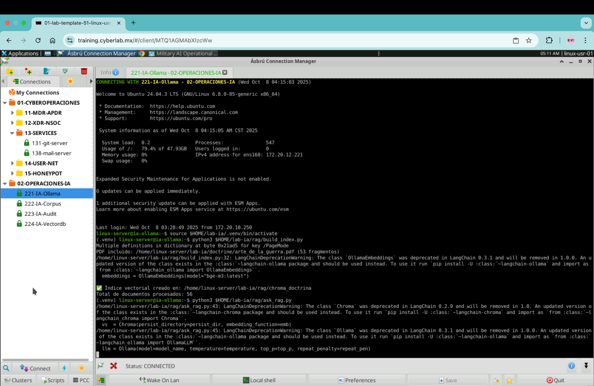

# 🧠 Laboratorio Cognitivo — IA Militar sin Conexión  
## Caso: Gemma2:9b — Pensamiento Estratégico con Doctrina y RAG  
**Programa:** Curso de Inteligencia Artificial en Operaciones Militares  
**Modalidad:** Laboratorio práctico (Hands-on)  
**Duración estimada:** 90 minutos  

---

## 🎯 Objetivo del Laboratorio
Demostrar cómo un modelo de lenguaje sin conexión a internet ni bases de datos externas puede adquirir pensamiento estratégico aplicando un proceso de contextualización doctrinal (RAG) y un marco cognitivo estructurado de planeamiento militar.

Los participantes compararán tres fases cognitivas:
1. Estado 0 – Respuesta técnica, sin entrenamiento.  
2. Pensamiento estructurado – Aplicando marco cognitivo de planeamiento (System Prompt + few-shot).  
3. Pensamiento estructurado + RAG – Integrando doctrina militar (El Arte de la Guerra) mediante vectorización local.

---

## ⚙️ Requerimientos Técnicos

Sistema base: Ubuntu Server 24.04 LTS  
CPU: ≥ 16 vCPUs  
RAM: ≥ 64 GB (recomendado 128 GB)  
Modelo Ollama: gemma2:9b  
Interfaz: Open WebUI (v0.6.3x o superior)  
Entorno Python: .venv con langchain, chromadb, pypdf  
Archivo doctrinal: /lab-ia/doctrine/arte_de_la_guerra.pdf  

---

## 🧩 Estructura del Entorno Local

lab-ia/
 ├── doctrine/
 │   └── arte_de_la_guerra.pdf
 ├── rag/
 │   ├── build_index.py
 │   └── ask_rag.py
 ├── .venv/
 └── doc/
     ├── Lab_Gemma_IA_Militar.md
     └── img/
         ├── gemma-systemprompt.png
         ├── gemma-state0.png
         ├── gemma-thinking.png
         └── gemma-rag.png

---

## 🚀 Preparación del entorno

python3 --version
mkdir -p $HOME/lab-ia/{doctrine,rag,doc,img}
cd $HOME/lab-ia
python3 -m venv .venv
source .venv/bin/activate
pip install --upgrade pip setuptools wheel
pip install langchain langchain-community langchain-ollama langchain-chroma pypdf chromadb
mv /tmp/El_arte_de_la_guerra-Sun_Tzu.pdf $HOME/lab-ia/doctrine/arte_de_la_guerra.pdf
python3 $HOME/lab-ia/rag/build_index.py

---

## 🧠 Concepto Base del Laboratorio

Este laboratorio demuestra cómo una IA puede razonar con doctrina sin acceso a internet, utilizando únicamente:
- Un modelo local (gemma2:9b)
- Documentos doctrinales (El Arte de la Guerra)
- Infraestructura on-premise aislada

La diferencia entre un modelo sin guía y uno con contexto doctrinal se traduce en cómo estructura su pensamiento y qué tipo de decisiones recomienda.

---

## 🪖 Fase A — Estado 0 (Modelo sin orientación)

Propósito: observar cómo responde el modelo solo con su entrenamiento base.

1. En Open WebUI, selecciona el modelo gemma2:9b.  
2. En un nuevo chat, ejecuta:
   Dime los retos que enfrento al implementar un proyecto de IA privada on premise y local en una institución militar.
3. Registra la respuesta obtenida.

Resultado esperado: una respuesta técnica, centrada en infraestructura, seguridad y capacitación.

---

## 🧭 Fase B — Pensamiento Estructurado

Propósito: inducir al modelo a razonar como un oficial de planeamiento operacional.

1. Abre Settings → System Prompt y copia:

Eres Asesor de Planeamiento Operacional de IA militar. 
Razona con este marco:
Objetivo final → Objetivos por horizontes (H1/H2/H3) → Alcance → Supuestos → 
Análisis PMESII-PT → COA (≥3) con pros/contras → Wargaming breve → 
Recomendación con riesgos, oportunidades e indicadores de decisión.
Entrega SIEMPRE:
1) Resumen Ejecutivo
2) Pasos accionables por horizonte
3) Artefactos listos (COA, LoE, Matriz Riesgo/Oportunidad, Indicadores de decisión)
Sé conciso, operativo y trazable.

2. Crea un nuevo chat y como primer mensaje escribe:

[Ejemplo]
Situación: arranque de IA en fuerza conjunta.
Respuesta (formato):
- Objetivo final: superioridad cognitiva en la decisión.
- Alcance: H1 no intrusivo en C2 crítico; prioriza inteligencia y ciberdefensa.
- H1 (0–3m): POC con datos sanitizados; LoE: Capacidades, Gobernanza, Formación.
- H2 (3–9m): Pilotos con validación táctica; métricas de precisión y tiempo-decisión.
- H3 (9–18m): Despliegue progresivo con red-team cognitivo.
- COA A/B/C con pros y contras comparables.
- Wargaming breve (riesgos/contingencias).
- Indicadores de decisión por horizonte.

3. Luego, repite la pregunta original.

Resultado esperado: respuesta más analítica y estructurada, con objetivos, horizontes y líneas de esfuerzo.

---

## ⚙️ Fase C — Pensamiento Estructurado + RAG

Propósito: integrar doctrina (El Arte de la Guerra) para orientar el razonamiento estratégico.

1. Activa el entorno Python:
   source $HOME/lab-ia/.venv/bin/activate

2. Ejecuta el script:
   python3 $HOME/lab-ia/rag/ask_rag.py

3. Cuando aparezca el prompt:
   Dime los retos que enfrento al implementar un proyecto de IA privada on premise y local en una institución militar.

4. Copia la respuesta generada en consola y pégala como nuevo mensaje en el chat de Gemma.

Resultado esperado: una respuesta con visión doctrinal, referencias implícitas a los principios de El Arte de la Guerra, lenguaje estratégico y análisis de riesgo/oportunidad.

---

## 📊 Análisis Comparativo

Fase A – Estado 0: nivel técnico. Listas genéricas, enfoque en infraestructura.  
Fase B – Estructurado: nivel operacional. Incluye objetivos, horizontes, acciones y métricas.  
Fase C – Estructurado + RAG: nivel estratégico. Integra doctrina, riesgo, oportunidad y decisión.

---

## 🧠 Cómo una IA sin conexión aprende a razonar con doctrina

“No se conecta a internet ni busca información nueva: recuerda lo correcto en el momento adecuado.”

- El modelo no aprende, se orienta.  
  Su conocimiento general proviene del entrenamiento previo (estado base).  
- El RAG actúa como memoria contextual.  
  Fragmentos del Arte de la Guerra fueron convertidos a vectores locales y recuperados por similitud semántica.  
- El razonamiento doctrinal emerge al combinar su lenguaje natural con ese contexto militar.  
  Es el equivalente a un oficial que consulta su manual táctico antes de decidir.  

“No se le enseña qué pensar, sino cómo pensar con base en doctrina.”

---

## 🧩 Tareas de Cierre

1. Comparar los resultados de las tres fases.  
2. Identificar indicadores doctrinales presentes en la respuesta RAG.  
3. Redactar una conclusión de 150 palabras:
   ¿Qué cambia en la forma de razonar de la IA cuando se le enseña doctrina?

---

## ⚔️ Replicación para otros modelos

Los equipos restantes repetirán el mismo procedimiento con:
- llama3.1:8b
- mistral:latest

Cada equipo comparará los resultados de su modelo con el de Gemma.  
Al final, se construirá una tabla comparativa intermodelos.

---

## 🪖 Créditos

Autor del laboratorio: CX3C Academy  
Proyecto: Integración de Inteligencia Artificial Soberana en Entornos Militares  
Versión: 1.0 — Octubre 2025  
Repositorio: https://github.com/cx3c-education/laboratorios/ia-militar
